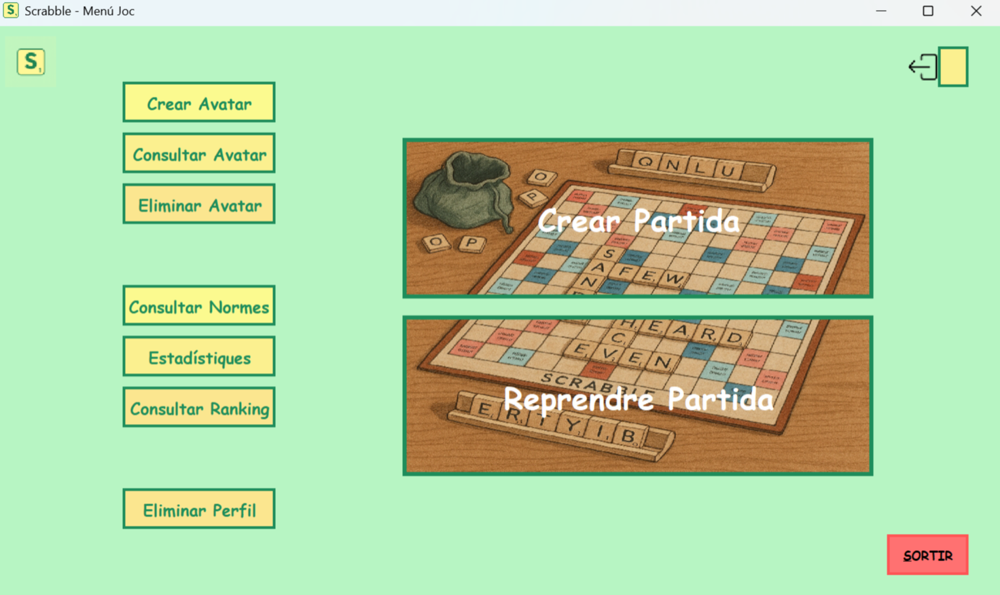
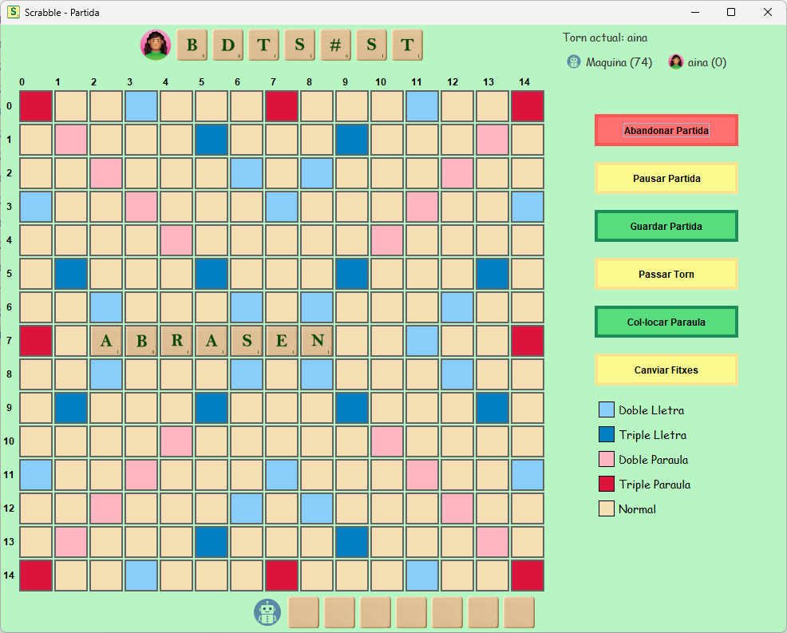
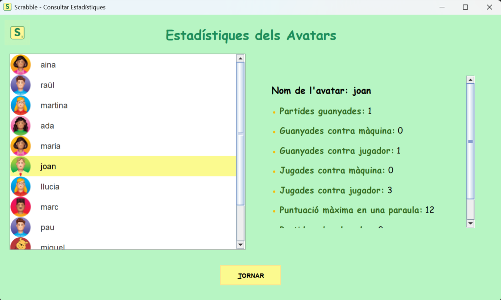

# Scrabble PROP


A cross‑platform Scrabble application (Windows & Linux) letting you play against a bot 🤖 or a friend 👥.

---

## 📋 Table of Contents

- [✨ Features](#✨-features)  
- [⚙️ Prerequisites](#⚙️-prerequisites)  
- [🚀 Installation & Running](#🚀-installation--running)  
  - [🐧 Linux](#🐧-linux)  
  - [🪟 Windows](#🪟-windows)  
- [📂 Project Structure](#📂-project-structure)  
- [📸 Screenshots](#📸-screenshots)  
- [🤝 Contributing](#🤝-contributing)  
- [👥 Authors](#👥-authors)  
- [📝 License](#📝-license)  

---

## ✨ Features

- Play in **Catalan**, **Spanish**, or **English** 🌍  
- Human vs. **Bot** 🤖 or Human vs. **Human** 👥  
- Profile management with different avatars and personal statistics 📊  
- For a better experience, turn on the sound on your computer 🔊
- Full Swing-based GUI, identical on Linux and Windows 🖥️  

---

## ⚙️ Prerequisites

- ☕ **Java 11** (or higher)
- 📦 **Gson 2.9** (for JSON load/save)

### 📥 Downloading Required Libraries

Before compiling, make sure to download the necessary `.jar` files:

- On **Linux/macOS**: run `./get_libs.sh`
- On **Windows**: run `get_libs.bat`

This will download Gson libraries into the `FONTS/lib/` directory.


---

## 🚀 Installation & Running

> All compile/run commands should be executed from the `SRC` directory.

### 🐧 Linux

```bash
# Compile
make

# Launch
./scrabble.sh
```

### 🪟 Windows

```powershell
# Compile
.\compilar.bat

# Launch
.\scrabble.bat
# (or double‑click the “Scrabble – PROP” shortcut in Explorer)
```
---

## 📂 Project Structure

> **Note:** Most of the source code is written in **Catalan**, as the project was developed in a trilingual academic environment.

```
SUBGRUP-PROP43.2/
│
├── DOCS/                     # Project documentation: UML's, algorithm rationale and Doxygen.
│
├── EXE/                      # Compiled classes & runtime files
│
├── SRC/                      # Source code & build scripts
│   ├── domini/               # Domain layer
│   │   ├── auxiliars/
│   │   ├── diccionari/
│   │   ├── excepcions/
│   │   ├── jugadors/
│   │   ├── scrabble/
│   │   └── sessio/
│   │
│   ├── persistencia/         # Persistence layer
│   ├── interficie/           # Presentation layer (Swing)
│   ├── controladors/         # Controllers
│   │
│   ├── lib/                  # Third‑party JARs
│   ├── resources/            # Images, .txt, Doxygen assets
│   ├── data/                 # Persistent data store
│   │
│   ├── Makefile              # Linux build
│   ├── compilar.bat          # Windows build
│   ├── scrabble.sh           # Linux launcher
│   ├── scrabble.bat          # Windows launcher (with debug)
│   ├── scrabble.vbs          # Windows launcher (no debug)
│   └── "Scrabble - PROP.lnk" # Windows shortcut
│
└── Doxyfile                  # Doxygen configuration
```

---

## 📸 Screenshots





---

## 🤝 Contributing

Feel free to fork the repository, improve the code, add features or fix bugs! 🚀

---

## 👥 Authors

- Raül Box  
- Aina Serra  
- Ada Peña  
- Martina Cusidó  

---

## 📝 License

This project is licensed under the **GNU GPL v3**. See [LICENSE](./LICENSE) for details.
